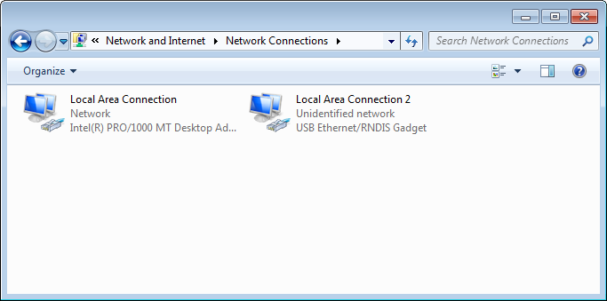

If you have not already, make sure you have followed the instructions in [Getting Started Step 4](Getting-started-v2#step-4-enable-usb-networking).

1. On your host computer, open up the *Network and Sharing Center* either using the notification tray icon or using *Control Panel > Network and Internet > Network and Sharing Center*. Click on *Change adapter aettings*.

    

2. You should see a connection that says *USB Ethernet/RNDIS Connection*. TODO: Add link to troubleshooting tips from exiting wiki page. Right-click it and select *Properties*.

    

3. In the dialog that opens, select the *Sharing* tab and check the box next to *Allow other network users to connect through this computer's Internet connection*.

    

    Click *OK* when you are done. For bonus points, you can rename the connection by right-clicking again and selecting *Rename*.

4. For some reason, this messes up my existing internet connection. 

4. Now, we need to find out what IP address our EV3 has. 

6. Now we are going to connect to the EV3 using ssh.

7. Now check out the list of [first things](Getting-started-v2#step-7-first-things-to-do-with-ev3dev) you should do with ev3dev.