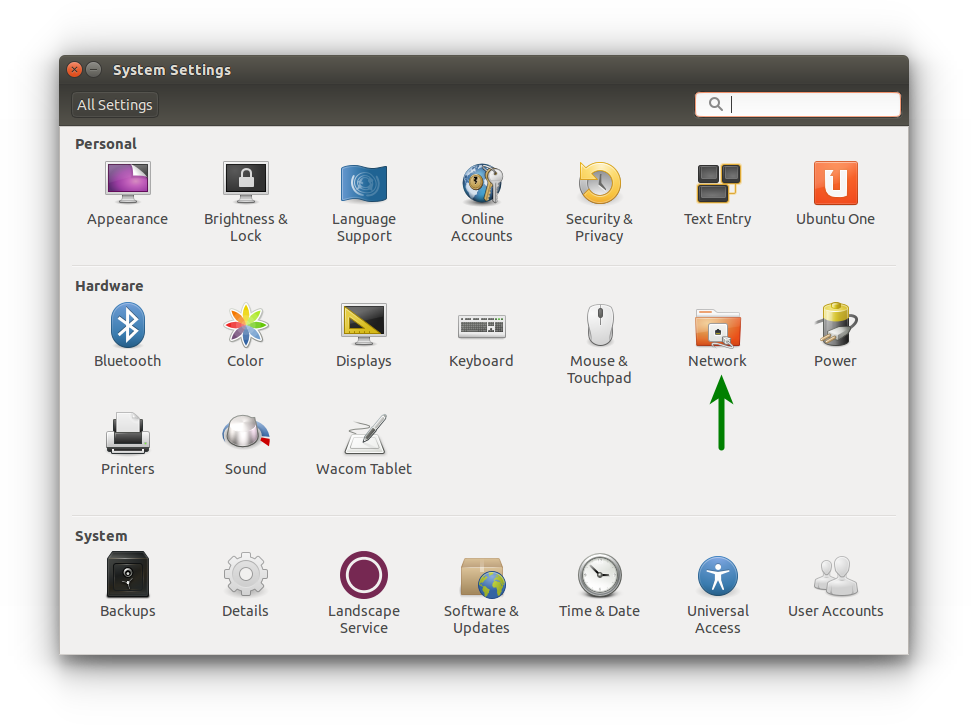
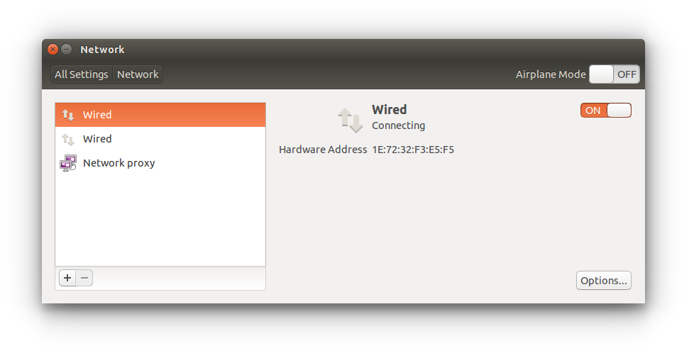
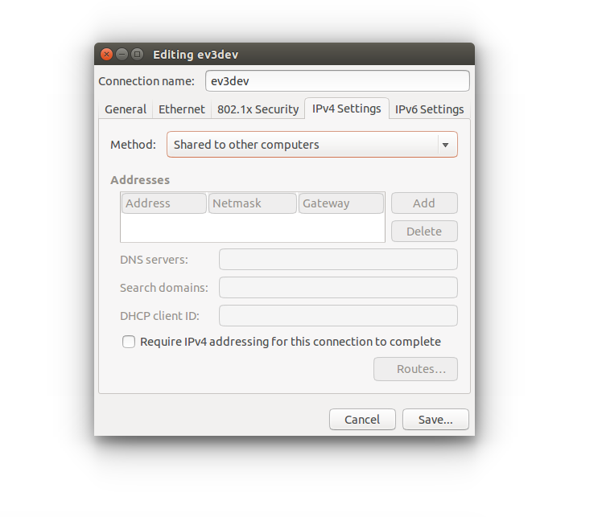
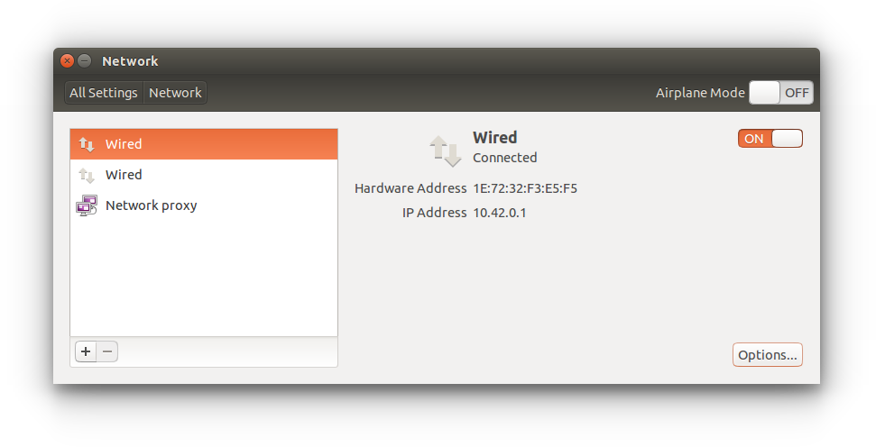

If you have not already, make sure you have followed the instructions in [Getting Started Step 4](Getting-started-v2#step-4-enable-usb-networking).

1. On your host computer, open up *System Settings* and select *Network*

    

2. In the *Network* dialog, you should see a Wired connection that says *Connecting*. Click the *Options...* button.

    

3. In the dialog that open, change the *Connection Name* to whatever you want (using *ev3dev* here). Select the *IPv4 Settings* tab and change the *Method* to *Shared to other computers*.

    

    Click *Save...* when you are done. The connection will now say that it is connected.

    

4. Now, we need to find out what IP address our EV3 has. Open a terminal window and run. The `10.42.` is from the *Network* window above, so if yours is different, change it to match.

        user@host:~$ cat /var/log/syslog | grep 10.42. | grep DHCP

    You should see something like this:

        Mar 27 19:00:38 host dnsmasq-dhcp[14783]: DHCP, IP range 10.42.0.10 -- 10.42.0.100, lease time 1h
        Mar 27 19:05:03 host dnsmasq-dhcp[14783]: DHCPOFFER(usb0) 10.42.0.41 66:f3:da:74:b5:62 
        Mar 27 19:05:03 host dnsmasq-dhcp[14783]: DHCPREQUEST(usb0) 10.42.0.41 66:f3:da:74:b5:62 
        Mar 27 19:05:03 host dnsmasq-dhcp[14783]: DHCPACK(usb0) 10.42.0.41 66:f3:da:74:b5:62 ev3dev

    This means that our EV3 is at 10.42.0.41.

6. Now we are going to connect to the EV3 using ssh. Replace 10.42.0.41 with the IP address you found in the system log.

        user@host:~$ ssh root@110.42.0.41

   If you have never connected before, you will prompted to confirm the authenticity of the host, so type `yes` when prompted.

        The authenticity of host '10.42.0.52 (10.42.0.52)' can't be established.
        ECDSA key fingerprint is be:9e:66:8b:d1:14:b8:8a:ea:4c:6e:07:2d:d9:68:05.
        Are you sure you want to continue connecting (yes/no)? yes
        Warning: Permanently added '10.42.0.52' (ECDSA) to the list of known hosts.

    The default root password is `r00tme`.

        root@10.42.0.52's password: 
        Linux ev3dev 3.3.0-0-ev3dev #2 PREEMPT Wed Mar 19 20:10:05 CDT 2014 armv5tejl
                     _____     _
           _____   _|___ /  __| | _____   __
          / _ \ \ / / |_ \ / _` |/ _ \ \ / /
         |  __/\ V / ___) | (_| |  __/\ V /
          \___| \_/ |____/ \__,_|\___| \_/
        
        Debian GNU/Linux 7 on LEGO MINDSTORMS EV3!
        
        The programs included with the Debian GNU/Linux system are free software;
        the exact distribution terms for each program are described in the
        individual files in /usr/share/doc/*/copyright.
        
        Debian GNU/Linux comes with ABSOLUTELY NO WARRANTY, to the extent
        permitted by applicable law.
        root@ev3dev:~# 

7. Now check out the list of [first things](Getting-started-v2#step-7-first-things-to-do-with-ev3dev) you should do with ev3dev.